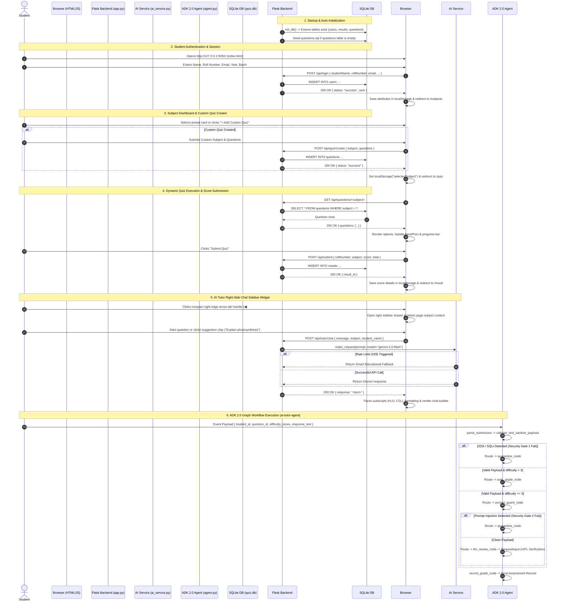

# 🔍 Complete Code Execution & Data Flow Guide

This document explains the end-to-end code execution flow, sequence diagrams, data persistence mechanisms, API call stacks, and architecture for the **Interactive Flashcard, Quiz & ADK 2.0 AI-Tutor Platform**.

---

## 🔁 End-to-End System Sequence Diagram



---

## 🛠️ Step-by-Step Code Execution Breakdown

### Phase 1: Server Initialization & Database Setup (`backend/app.py`)

When launching `python3 run.py`:
1. **Flask App Initialization**: `run.py` imports `app` from `backend/app.py`. `app.py` sets up absolute template (`templates/`) and static asset (`static/`) paths.
2. **Database Auto-Initialization (`init_db()`)**:
   - Establishes connection to SQLite database at `backend/database/quiz.db`.
   - Creates three primary schema tables if not present:
     - `users`: `id`, `student_name`, `roll_number`, `email`, `year`, `batch`, `login_time`.
     - `results`: `id`, `student_name`, `roll_number`, `subject`, `score`, `total`, `submitted_at`.
     - `questions`: `id`, `subject`, `question_text`, `option_a`, `option_b`, `option_c`, `option_d`, `correct_index`.
   - Reads `backend/database/questions.sql` to populate default subject questions (*Web Hosting*, *C Programming*, *Python*) if `questions` table is empty.

---

### Phase 2: User Authentication & Session (`static/js/app.js` & `templates/index.html`)

1. **Client Form Submission**:
   - `templates/index.html` loads `static/js/app.js`.
   - Validates student input:
     - Roll Number must be a 3-digit number (`/^\d{3}$/`).
     - Email must match standard email pattern (`/^[^\s@]+@[^\s@]+\.[^\s@]+$/`).
2. **API Endpoint (`POST /api/login`)**:
   - Receives JSON payload: `{ studentName, rollNumber, email, year, batch }`.
   - Inserts record into `users` table.
   - Returns `200 OK` response.
3. **Session Persistence**:
   - `app.js` stores user credentials in `localStorage` (`studentName`, `rollNumber`, `email`, `year`, `batch`).
   - Redirects user to `/subjects`.

---

### Phase 3: Subject Selection & Custom Quiz Creation (`static/js/subject.js`)

1. **Dashboard Loading**:
   - Reads `localStorage.getItem("studentName")` and updates heading greeting.
2. **Custom Quiz Builder Modal**:
   - Clicking `+ Add Custom Quiz` opens the custom builder modal.
   - Student submits new subject title, description, and custom question cards.
   - Sends `POST /api/quiz/create` payload containing `{ subject, description, questions }`.
   - Backend inserts custom questions into `questions` table.
3. **Subject Selection**:
   - Clicking any subject card sets `localStorage.setItem("selectedSubject", subjectName)` and redirects to `/quiz`.

---

### Phase 4: Dynamic Quiz Engine & Scoring (`static/js/quiz.js`)

1. **Fetching Subject Questions**:
   - On `DOMContentLoaded`, `quiz.js` calls `GET /api/questions/<selectedSubject>`.
   - Backend queries `SELECT * FROM questions WHERE LOWER(subject) = LOWER(?)` and returns JSON options array.
2. **Interactive Question Rendering**:
   - Renders progress bar, question prompt, and option choices (`A`, `B`, `C`, `D`).
   - Highlights user selection and tracks state in `userAnswers` object.
3. **Quiz Submission (`POST /api/submit`)**:
   - Calculates score comparing `userAnswers[idx]` against `correct_index`.
   - Sends JSON payload `{ studentName, rollNumber, subject, score, total }` to `/api/submit`.
   - Backend records attempt into `results` table.
   - `quiz.js` stores `quizScore`, `quizTotal`, and solution details in `localStorage` and redirects to `/result`.

---

### Phase 5: Score Review & Analytics Dashboard (`static/js/result.js` & `static/js/profile.js`)

1. **Result Breakdown (`static/js/result.js`)**:
   - Computes score percentage and renders performance badge.
   - Dynamically highlights correct answers vs. incorrect user choices.
   - Calls `GET /api/results/<rollNumber>` to fetch and render previous database attempt history.
2. **Profile Analytics (`static/js/profile.js`)**:
   - Calls `GET /api/user/<rollNumber>`.
   - Backend computes total quizzes taken, pass count (≥ 60%), and average percentage score.
   - Displays avatar initials, stats cards, and complete attempt logs.

---

### Phase 6: AI Tutor Right-Side Chat Sidebar Widget (`static/js/ai-tutor-widget.js` & `backend/app.py`)

1. **DOM Injection**:
   - `ai-tutor-widget.js` injects floating action button (`#ai-tutor-fab`), overlay backdrop, and slide-out right drawer (`#ai-tutor-sidebar`) into any active page.
2. **Context Detection**:
   - Auto-detects current active subject from `localStorage.getItem("selectedSubject")` and updates context banner (`📚 Context: Web Development`).
3. **API Processing (`POST /api/tutor/chat`)**:
   - Sends user prompt, student name, and subject context to `/api/tutor/chat`.
   - Backend constructs a pedagogical system prompt and calls `make_request(prompt, model='gemini-2.0-flash')`.
   - If API quota is throttled (`429 RESOURCE_EXHAUSTED`), `make_request` activates the **Smart Educational Fallback Engine** in `backend/ai_service.py` to generate structured, formatted study notes instantly.
4. **Subscript & HTML Formatting**:
   - `formatMessageText` in `ai-tutor-widget.js` automatically parses chemical/math formulas (e.g. `H2O`, `CO2`, `C6H12O6`, `O2`) and converts them into proper HTML subscript tags (`H<sub>2</sub>O`, `CO<sub>2</sub>`) without displaying raw LaTeX dollar signs.

---

### Phase 7: ADK 2.0 AI-Tutor Graph Workflow Agent (`ai-tutor-agent/app/agent.py`)

```
START Event -> parse_submission -> validate_and_sanitize_payload
                                      ├─► (Security Gate 1 Fail: XSS/SQLi) ──► quarantine_node
                                      ├─► (valid & difficulty < 3) ────────────► auto_grade_node
                                      └─► (valid & difficulty >= 3) ───────────► prompt_guard_node
                                                                                    ├─► (Security Gate 2 Fail: Injection) ──► quarantine_node
                                                                                    └─► (clean payload) ────────────────────► llm_review_node ──► tutor_verification_node (HITL)
```

1. **`parse_submission`**: Decodes raw JSON or base64 Pub/Sub payload under `"data"`.
2. **`validate_and_sanitize_payload` (Pre-Ingestion Security Boundary)**:
   - Validates schema data types.
   - Escapes HTML script tags and strips SQL injection patterns (`UNION SELECT`, `; --`).
   - Short-circuits malicious inputs to `quarantine_node`.
3. **`prompt_guard_node` (Pre-LLM Security Boundary)**:
   - Scans text for jailbreak & prompt injection attempts (`"ignore system instructions"`, `"DAN mode"`).
   - Diverts attack payloads to `quarantine_node` before invoking Gemini.
4. **`auto_grade_node`**:
   - Executes deterministic Python logic for low-difficulty questions (< 3).
5. **`llm_review_node` & `tutor_verification_node`**:
   - Evaluates high-difficulty submissions (≥ 3) with `gemini-2.0-flash`.
   - Pauses execution with `RequestInput` carrying full security audit metadata (`sanitization_status`, `prompt_injection_score`, `risk_level`) for human tutor verification before recording final grade.

---

## 🔌 Complete REST API Reference Table

| Endpoint | Method | Purpose | Request Body | Response Output |
| :--- | :--- | :--- | :--- | :--- |
| `GET /` | `GET` | Render Login Page | None | HTML Page (`index.html`) |
| `POST /api/login` | `POST` | Register student login | `{ studentName, rollNumber, email, year, batch }` | `{"status": "success", "user": {...}}` |
| `GET /subjects` | `GET` | Render Subject Selection Page | None | HTML Page (`subjects.html`) |
| `GET /api/subjects` | `GET` | Fetch list of available subjects | None | `{"status": "success", "subjects": [...]}` |
| `POST /api/quiz/create` | `POST` | Create custom subject & questions | `{ subject, description, questions: [...] }` | `{"status": "success"}` |
| `GET /quiz` | `GET` | Render Interactive Quiz Page | None | HTML Page (`quiz.html`) |
| `GET /api/questions/<subject>` | `GET` | Fetch quiz questions by subject | None | `{"status": "success", "questions": [...]}` |
| `POST /api/submit` | `POST` | Record quiz score to database | `{ studentName, rollNumber, subject, score, total }` | `{"status": "success", "result_id": 1}` |
| `GET /result` | `GET` | Render Quiz Result Review Page | None | HTML Page (`result.html`) |
| `GET /api/results/<rollNumber>` | `GET` | Fetch all quiz attempts for student | None | `{"status": "success", "history": [...]}` |
| `GET /profile` | `GET` | Render Profile Dashboard Page | None | HTML Page (`profile.html`) |
| `GET /api/user/<rollNumber>` | `GET` | Fetch profile & analytics metrics | None | `{"status": "success", "user": {...}, "metrics": {...}}` |
| `POST /api/tutor/chat` | `POST` | Process AI Tutor Chat query | `{ message, subject, student_name }` | `{"status": "success", "response": "<formatted_text>"}` |
